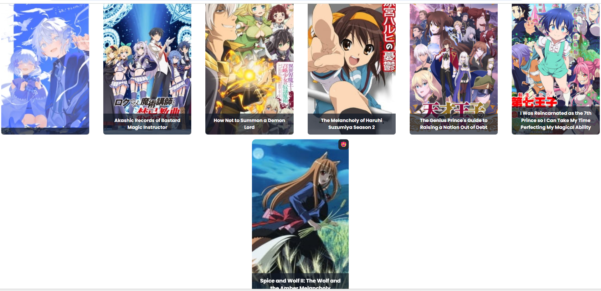

# 🌸 Anime Ecstasy

> 🎥 Your ultimate **Anime Discovery & Watchlist App** – powered by React + Tailwind + Anime API  
> [🌐 Live Demo](https://anime-ecstasy.chandrasekhara.me) • 

---

## 📺 What is Anime Ecstasy?

**Anime Ecstasy** is your personal anime dashboard – browse trending anime, add them to your watchlist, and keep track of what you love. A beautiful, responsive UI built for fans by fans.

---

## ✨ Key Features

| Feature | Description |
|--------|-------------|
| 🎬 **Trending Anime Gallery** | Explore the most talked-about anime with stunning visuals and titles. |
| ⭐ **Add to Watchlist** | Found something you like? Save it instantly. Your list is safe even after closing the browser – thanks to `localStorage`. |
| ❌ **Remove from Watchlist** | No longer interested? Remove any anime with a single click. |
| 📖 **Pagination** | Browse seamlessly across multiple pages using intuitive pagination. |
| 📱 **Fully Responsive** | Works flawlessly on mobile, tablet, and desktop screens. |

---

### 🖼️ Screenshots

> 🧪 *Try the live version here:* [Anime Ecstasy Demo](https://anime-ecstasy.chandrasekhara.me)

---

#### 🌸 Hero Section – Welcome Banner


---

#### 🔍 Search Results – Explore Your Favorite Anime


---

#### 📃 Trending Anime – Most Popular Shows



---

---

## 💻 Tech Stack

| Tech | Purpose |
|------|---------|
| ⚛️ React (Vite) | Frontend framework |
| 🌐 Axios | API requests |
| 💨 Tailwind CSS | Beautiful & fast UI |
| 💾 localStorage | Persistent watchlist |
| 🐱 Anime API | Real-time data from anime APIs like Jikan (MyAnimeList) |

---

## 🔥 Sample Anime Titles

Use these real fan-favorite titles to populate your gallery:

- **🔮 Jujutsu Kaisen**
- **🔥 Demon Slayer**
- **⚔️ Attack on Titan**
- **🦸 My Hero Academia**
- **🧨 Chainsaw Man**
- **🕵️ Spy × Family**
- **📦 One Piece**
- **⚽ Blue Lock**
- **🎭 Oshi no Ko**
- **📜 Frieren: Beyond Journey's End**

---

## 🗂️ Project Structure

```
src/
├── components/
│   ├── Anime/
│   │   ├── Anime.jsx
│   │   ├── AnimeCard.jsx
│   │   ├── Banner.jsx
│   │   └── Pagination.jsx
│   ├── Navbar.jsx
│   └── WatchList.jsx
├── App.jsx
├── main.jsx
└── assets/
```

---

## 🚀 Getting Started

### 📦 Clone the Repo

```
git clone https://github.com/Chandu6702/anime-ecstasy.git
cd anime-ecstasy
```

### 📥 Install Dependencies

```
npm install
```

### 🧪 Run the App

```
npm run dev
```

Open your browser and go to: `http://localhost:5173` 🎉

---

## 🤝 Contributing

All anime lovers and open-source enthusiasts are welcome!

### How to Contribute

1. 🍴 Fork the repository  
2. 🪴 Create a new branch  
   ```
   git checkout -b feature-name
   ```
3. 💻 Make your changes  
4. ✅ Test your changes locally  
5. 🚀 Open a Pull Request

Please read [`CONTRIBUTION.md`](./CONTRIBUTION.md) for detailed guidelines.

---

## 📄 License

This project is licensed under the **MIT License**.  
You are free to use, modify, and distribute this software as long as the original license is included.

View the full license [here](./LICENSE).

---

## 💖 Created with Passion

> _“For the fans who start one episode... and end up finishing the whole season at 3AM.”_

Made with ❤️ by **Anime Ecstasy**
